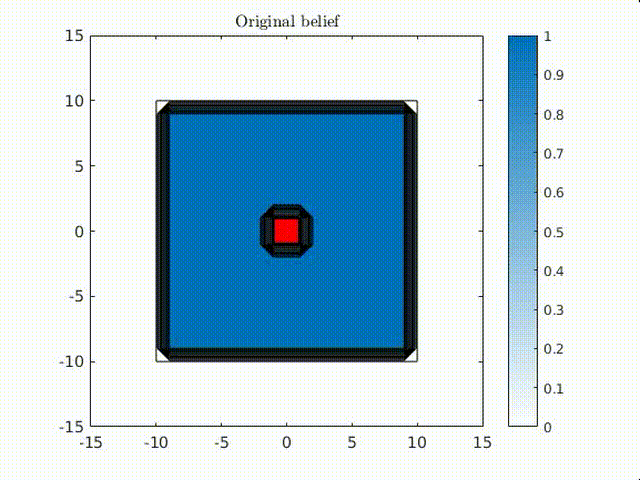
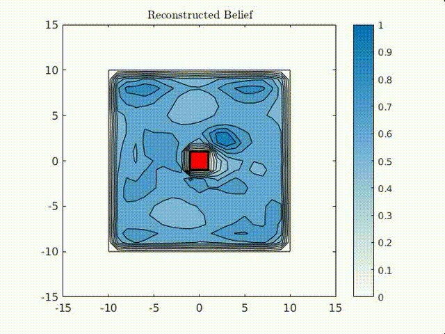
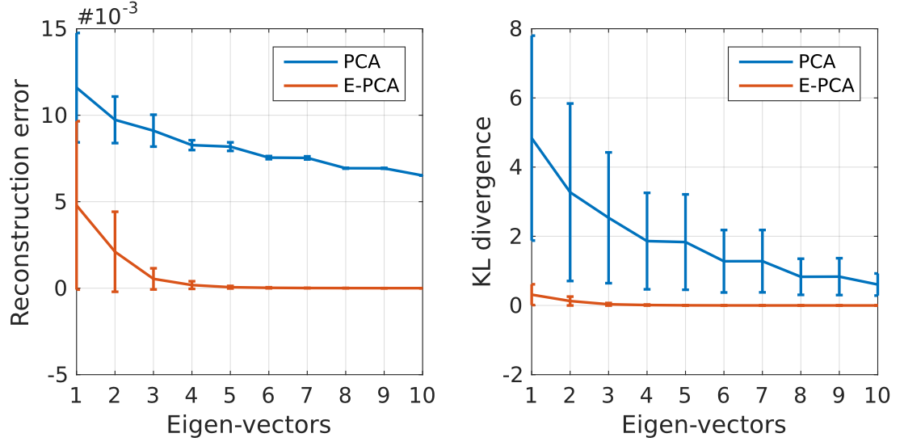
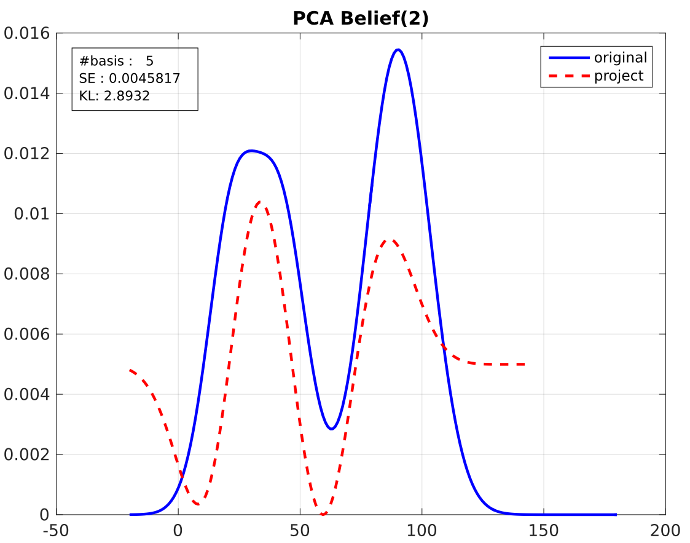
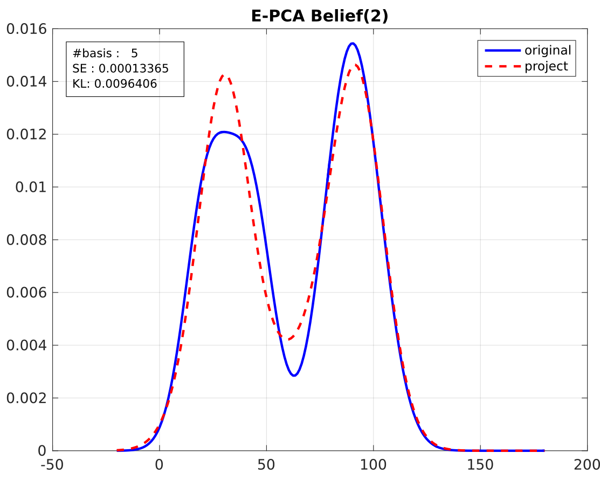
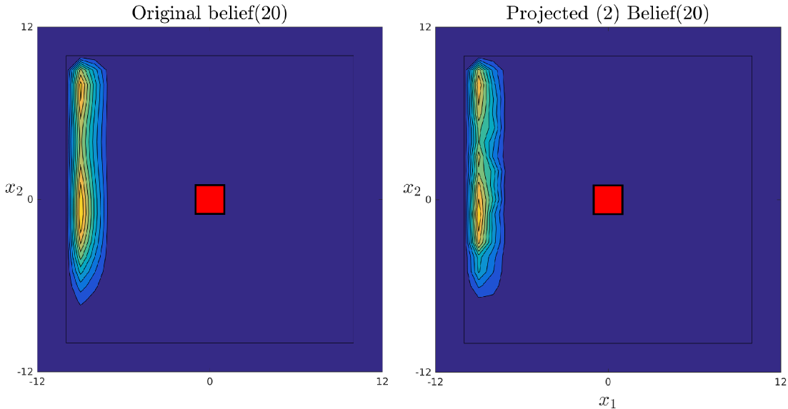

# e-pca

Matlab implementation of E-PCA which is a non-linear dimensionality reduction method particularly suited for probability distribtions, see the paper [Exponential Family PCA for Belief Compression
in POMDPs](http://www.cs.cmu.edu/~ggordon/nickr-ggordon.nips02.pdf). The left figure illustrates a filtered 2D probability distribution of an agent's location in a square world with a red block (goal state) at its center. The right figure is the result of the probability density function being reconstructed after a latent lower dimensional space was leaned via E-PCA.

<p align="center">
 
</p>

In the above animation the origininal dimension of the probabilitiy distribution is 625 and the learned E-PCA latent space
has 8 dimensions. This is a very large compression, we went from 625 dimensions to 8 and as we can see the reconstructed probability distributions (right) are very similar to the original distributions (left).

The optimisation to find the latent space feature space is convex and can be solved though Newton's methods. The matalab implementation follows closely the aglorithm details given in the paper [Finding Approximate POMDP Solutions Through Belief
Compression](https://arxiv.org/pdf/1107.0053.pdf), see page 14.

# Installation 

After downlonading and extracting e-pca to your matlab workspace and you are in the matlab Command Window terminal 
make sure you are loacted outside the e-pca directory and run:

```matlab
>>> addpath(genpath('./e-pca'))
```

# Examples

Two examples are given [Example1.m](https://github.com/gpldecha/e-pca/blob/master/Example1.m), [Example2.m](https://github.com/gpldecha/e-pca/blob/master/Example2.m). The first example compares PCA vs E-PCA on a
auto-generated dataset of multi-modal probability distributions. The second example does the same but with 
a dataset of 2D probability distribtions.

## Example 1

In [Example1.m](https://github.com/gpldecha/e-pca/blob/master/Example1.m), you will first generate a set of random 
probability distributions and find two latent spaces, one via PCA and the other via E-PCA. You will systematically 
evaluate the effect on both the reconstruction error and KL-divergence between the re-projected compressed beliefs
with the original data. You should get the figure below:

<p align="center">

</p>

As we can see E-PCA outperforms PCA. You will also visually analys the reconstructed beliefs. Below you can see the result from PCA and E-PCA for the case when 5 eigenvectors where retained.

<p align="center">
 
</p>

## Example 2

[Example2.m](https://github.com/gpldecha/e-pca/blob/master/Example2.m) is similar to Example1, however a dataset of probability distributions is already provided for you. In this example you will be able to visually inspect the difference between the original probability distributions and their reconstruction after first compressing them. You should get a figure similar to the one below:

<p align="center">
 
</p>


